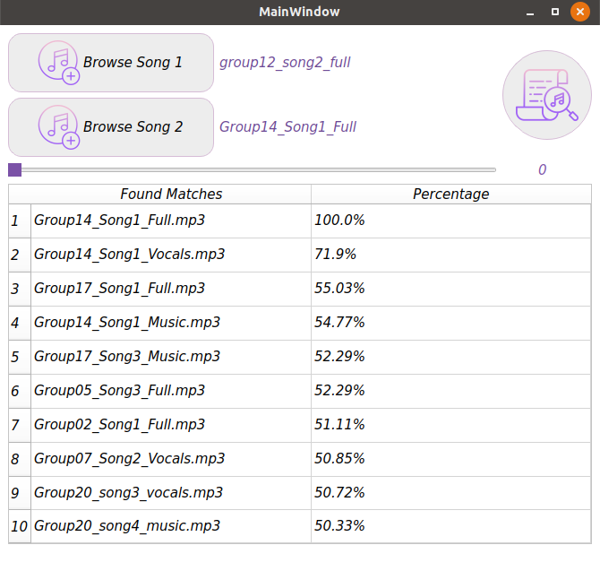

# Fingerprint-Shazam-like-app-

#### Fingerprinting is basically to identify a signal based on a short sample for it which usually has its intrinsic features and thus these intrinsic features can be used to identify the different varieties or flavors of the signal. 

- Several applications can be directly spotted for such technique. For example:
  - Music industry: Identify a song, a singer voice, a tune.
  - Medical diagnosis: identify arrhythmia types in ECG signals.

- The code can iterate over the songs in the shared folder to generate the spectrogram for each song, these files will be generated on local folder.
The spectrogram will always be generated for the first 1 min of the song regardless of its length.
- For each spectrogram:
  - It extracts the main features in each spectrogram (MFCC component, Melspectrogram component, Chroma Stft component) and collect them in some file along with the spectrogram.
  - Then uses perceptual hash function to hash the collected features into a shorter sequence. 
  - Both outputs from the previous two items are the fingerprint for each song.
 
- Now, given any sound file (either song, or vocals, or music), you should be able to generate its spectrogram features and be able to list the closest songs to it from the shared folder. The program generates some similarity index to each song then sort them and output the sorting list along with each similarity check in a nice table in GUI.
 
- The program can take two files, make a weighted average of them, and software treats the new summation as a new file and search for the closest songs to it. One would expect the contributing songs to come with the higher similarity index.

## Shazam GUI:
  



## DataBase

In order to make your own CSV Database:
  1. Add Whatever songs you want in the folder CreateDB.
  2. Run the CreateDateBase.py file by 
     ```bash
     python CreateDateBase.py 
     ``` 
     (You can change the name of the csv file from line 47 in CreateDataBase.py).
  
  3. Wait a Few minutes and it's done!

## Run the App 

  1. change the name of the csv in main.py in line 75 to the new name of the csv that you made.
  2. Run the main.py file by 
     ```bash
     python main.py
     ```
  3. Pick either one song, or two songs and mix between them (The slider percentage applies to the first song while the second song takes 100-Percentage).
  4. Click the search button to see what songs from your database match the Songs you entered the best!

## Excutable file

> I assume you're using linux, using windows should work fine but with some few tweaks.

You can generate an excutable version of the program by :
1. Run this command 
   ```bash
   pyinstaller --onefile --add-data=.:/ main.py
   ```
2. Copy the `CreateDB` directory with its csv database into the generated `dist` directory.
3. Navigate to `dist` directory by running :
   ```bash
   cd dist/
   ```
   then run the excutable main file by 
   ```bash
   ./main
   ```
